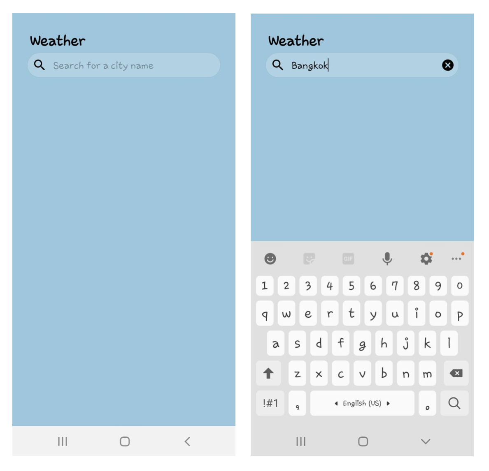
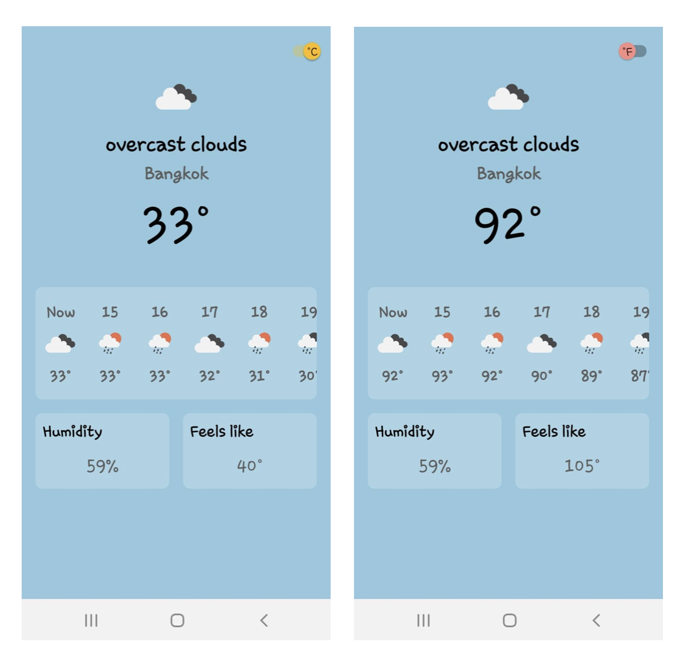

# Weather

### Screen
* Insert city name

* The weather for both current time and whole-day forecast
* Have the switch on top screen for switch temperature between Celsius and Fahrenheit

### Recommendation for future
* implement 7-day forecast - You can inject adapter for 7-day forecast into ConcatAdapter
* Reusable Foundation Module for other app
